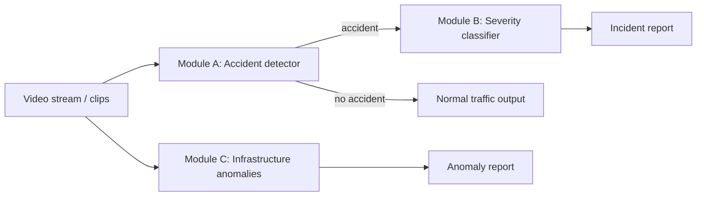

# Traffic Incident CV Starter

Стартовая заготовка дипломного проекта по модульному анализу видеопотоков дорожных камер.

Проект построен как каскад из трёх направлений:

1. **Accident detection** — бинарная задача `accident / no_accident`.
2. **Severity classification** — классификация аварии `minor / moderate / major`.
3. **Infrastructure anomalies** — отдельная ветка для более позднего этапа.

Репозиторий ориентирован на поэтапную разработку, воспроизводимые эксперименты и нормальную git-структуру, а не на один большой ноутбук.

## Что уже заложено

- модульная структура `src/`;
- интерфейсы и доменные схемы;
- шаблоны конфигов для baseline, video-baseline и hybrid-подхода;
- скрипты для построения manifest-файлов, обучения, оценки, инференса и потокового бенчмарка;
- документация по архитектуре, данным, экспериментам и этапам реализации;
- unit-тесты на ключевые контракты;
- пример того, как разделять исследовательскую часть и прикладной пайплайн.

## Каркас исследования

| Направление | Цель | Стартовый статус |
|---|---|---|
| ConvNeXt baseline | Сильный и понятный baseline на клипах | Интерфейсы и конфиги готовы |
| R3D-18 / SlowFast | Честный video-baseline | Интерфейсы и конфиги готовы |
| YOLOv11 + ConvNeXt | Основной гибридный эксперимент | Интерфейсы и конфиги готовы |
| Severity branch | Отдельная задача для аварийных клипов | Заготовка готова |
| Anomaly branch | Следующий этап после стабилизации A/B | Заготовка и план готовы |

## Рекомендуемая последовательность разработки

1. Подтвердить структуру датасетов на диске.
2. Собрать и проверить manifests.
3. Реализовать baseline для `accident / no_accident`.
4. Добавить video-baseline.
5. Реализовать hybrid-модель с YOLO.
6. После стабилизации бинарного модуля перейти к `severity`.
7. Только после этого разворачивать ветку аномалий.

## Быстрый старт

```bash
python -m venv .venv
source .venv/bin/activate
pip install -r requirements.txt
python scripts/smoke_test.py
```

## Управление Runpod pod через API

Если нужно выключить pod и не потерять данные, используйте отдельный CLI:

```bash
python scripts/manage_runpod_pod.py show --pod-id $RUNPOD_POD_ID
python scripts/manage_runpod_pod.py shutdown --pod-id $RUNPOD_POD_ID
```

Важно:

- для обычного pod без `network volume` команда `shutdown` вызывает `stop`;
- `stop` сохраняет `/workspace`, но очищает container disk;
- если у pod подключён `network volume`, Runpod не даёт сделать `stop`, только `delete/terminate`;
- в этом случае нужен явный флаг:

```bash
python scripts/manage_runpod_pod.py shutdown --pod-id $RUNPOD_POD_ID --allow-delete-with-network-volume
```

Такой сценарий удаляет сам pod, но сохраняет данные `/workspace` в attached network volume.

## Подготовка данных

Перед первым обучением теперь есть отдельный preflight:

```bash
python scripts/audit_dataset.py --config configs/datasets/ai_city.yaml
python scripts/audit_dataset.py --config configs/datasets/balanced_accident.yaml
python scripts/prepare_data.py
```

`prepare_data.py`:

- проверяет структуру и ожидаемые объёмы датасетов;
- проверяет покрытие `datasetA_vid_stats.txt` для AI City;
- строит manifests для `ai_city`, `balanced_accident` и merged `accident_binary`;
- пишет readiness report в `outputs/data_preflight/readiness_report.json`.

Если нужен только отчёт без записи manifests:

```bash
python scripts/prepare_data.py --dry-run
```

## Быстрая проверка конфигов и entrypoint-ов

```bash
python scripts/build_manifests.py --config configs/datasets/ai_city.yaml --dry-run
python scripts/build_manifests.py --config configs/datasets/balanced_accident.yaml --dry-run
python scripts/train_accident.py --config configs/experiments/accident_convnext.yaml --dry-run
python scripts/train_severity.py --config configs/experiments/severity_convnext.yaml --dry-run
```

## Автоматический workflow от каталогов с видео до обучения

Если нужно не вызывать все шаги вручную, а дать репозиторию корни датасетов и получить полный проход:

```bash
python scripts/run_end_to_end_workflow.py \
  --ai-city-root "F:/AIC21_Track1_Vehicle_Counting" \
  --balanced-root "F:/Balanced Accident Video Dataset" \
  --output-root outputs/auto_workflow/latest \
  --device cuda
```

Что делает этот orchestrator:

- запускает `prepare_data.py`;
- запускает harmonization;
- параллельно строит `balanced_grouped_windows_gap96` и `severity_real_only`;
- обучает текущую рабочую линию `accident`;
- обучает текущую рабочую линию `severity`;
- снимает `post-eval`.

Текущие конфиги под этот сценарий:

- `configs/experiments/accident_convnext_defendable_best.yaml`
- `configs/experiments/severity_r3d_uniform_best.yaml`

Если нужен только план команд без реального запуска:

```bash
python scripts/run_end_to_end_workflow.py \
  --ai-city-root "F:/AIC21_Track1_Vehicle_Counting" \
  --balanced-root "F:/Balanced Accident Video Dataset" \
  --dry-run
```

## Demo UI: загрузка видео на оценку и авторазметку

Для наглядной демонстрации уже обученных моделей добавлен локальный web-интерфейс:

```bash
python scripts/launch_demo_ui.py --host 127.0.0.1 --port 8090
```

После запуска открыть:

- `http://127.0.0.1:8090`

Что умеет интерфейс:

- загрузить произвольное видео;
- прогнать его по текущей accident-модели;
- при положительных окнах попытаться определить `severity`;
- показать summary, таблицу окон и сегменты разметки;
- сохранить bundle:
  - `assessment.json`
  - `annotations.jsonl`
  - `window_predictions.jsonl`
  - `report.html`

CLI-эквивалент для того же сценария:

```bash
python scripts/infer_saved_video.py \
  --video "path/to/video.mp4" \
  --device cuda \
  --output-dir outputs/demo_examples/manual_cli_example
```

Готовый пример inference-bundle уже лежит здесь:

- `outputs/demo_examples/balanced_major_2021_02_030_fuller/report.html`

## Дерево проекта

```text
traffic_incident_cv_starter/
├── configs/
├── data/
├── docs/
├── notebooks/
├── outputs/
├── scripts/
├── src/traffic_incident_cv/
└── tests/
```

## Принципиальная архитектура



## Технические решения, которые уже отражены в каркасе

- **Manifest-first design**: всё обучение и оценка завязаны на JSONL-manifest, а не на хрупкие ad-hoc обходы папок.
- **Эксперименты через YAML**: модель, данные и режим запуска конфигурируются отдельно.
- **Интерфейсы до реализации**: сначала фиксируются контракты, потом пишется код.
- **Стабильное масштабирование**: baseline → video-baseline → hybrid → severity → anomalies.

## Что дописывается в первую очередь

- чтение видео и нарезка клипов;
- фактические модели на `torchvision` / `ultralytics`;
- train/val loop с логированием и чекпойнтами;
- отчёты по метрикам и графикам;
- устойчивый потоковый инференс на длинных AI City видео.

## Полезные документы

- `docs/ARCHITECTURE.md`
- `docs/IMPLEMENTATION_PLAN.md`
- `docs/EXPERIMENT_MATRIX.md`
- `docs/DATA_PROTOCOL.md`
- `docs/RUNPOD_DEPLOYMENT.md`

## Лицензия

Внутренняя рабочая заготовка для дипломного проекта. При публикации наружу стоит отдельно проверить лицензии датасетов, весов моделей и внешних зависимостей.


